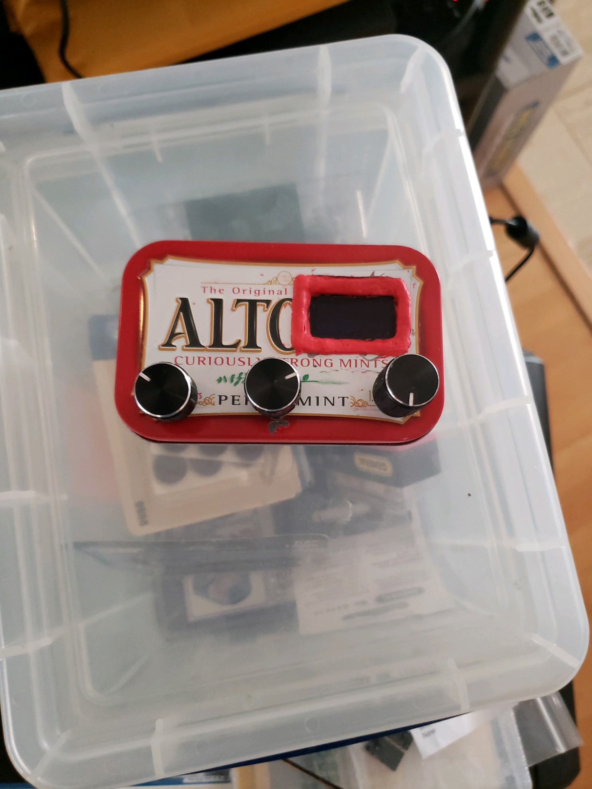
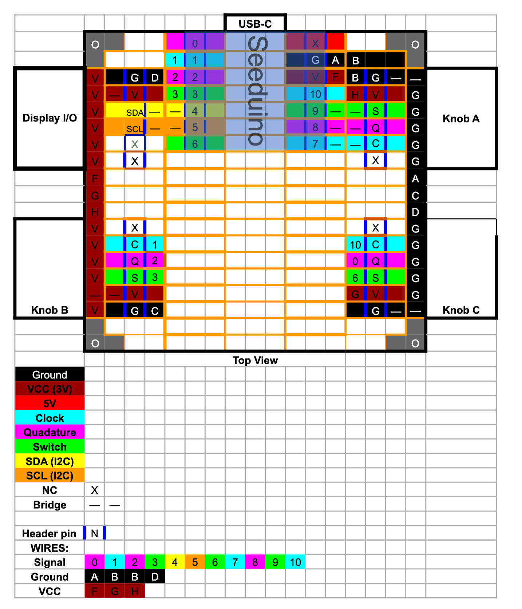
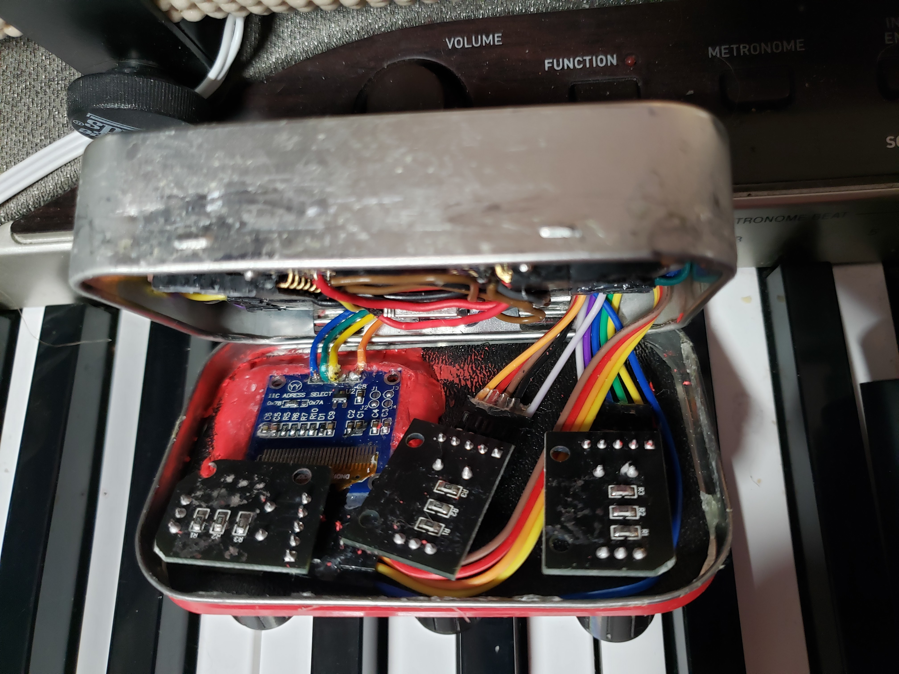

# RWK Altoid MIDI Box

I've always wanted to stick some electronics in an Altoid box. And I've always wanted a little box with knobs and a display that I could program to control MIDI setups, programmable according to my needs.

The result is:

The hardware is just 3 quadrature rotary encoders and a display, connected on a breadboard according to this diagram. The colors indicate connected pads, either by jumper or solder bridge. The knob and display connectors are right-angle headers. The specific breadboard I used is one section of these [ElectroCookie Snappable PCB, Strip Board with Power Rails](https://www.amazon.com/gp/product/B07ZYTZ48N/ref=ppx_yo_dt_b_asin_image_o04_s01?ie=UTF8&psc=1).

I drilled holes for the rotary encoders in the lid, spaced to fit. (It's a very tight fit; if you can find encoders with a smaller footprint it would make assembly easier.) I cut a hole for the display, then lined the edges with Sugru moldable adhesive to protect against the sharp edges (and attempted to use it to mount the display, but this was not successful. I ended up using cyanacrolate glue).

The circuit board is really there just to provide a platform for connections directly to the Seeeduino XIAO. I think on my next build, I will eliminate it entirely and wire directly to the XIAO MCU, to free up space. Aternatively, I might create a PCB, to better accomodate the mounting of the display, encoders, and position the XIAO so the USB connector is firmly placed at the small cutout in the rear. (I managed to firmly place it with glue, improvised standoffs, and a bit of bracing provided by one more horizontal header, that happened to be just the size needed.)

I'll need to give better instructions and images to make this more turnkey, but part of the fun was figuring out how to get everything to fit.

### <a name="materials">Materials Needed</a>
* [Seeeduino XIAO](https://www.amazon.com/gp/product/B087D2VSBL/ref=ppx_yo_dt_b_asin_title_o07_s00)
* [Altoid Box](https://www.amazon.com/ALTOIDS-Curiously-Strong-Peppermint-Pocket-Sized/dp/B07GG67NNH/ref=sr_1_7) (Remove and eat candy before use)
* [Rotary Encoders (quadature, with momentary pushbutton action)](https://www.amazon.com/gp/product/B07B68H6R8/ref=ppx_yo_dt_b_asin_title_o01_s02) x3
* [Display OLED 12864 128x64](https://www.amazon.com/gp/product/B08FD643VZ/ref=ppx_yo_dt_b_asin_title_o03_s01)
* [ElectroCookie Snappable PCB, Strip Board with Power Rails](https://www.amazon.com/gp/product/B07ZYTZ48N/ref=ppx_yo_dt_b_asin_image_o04_s01?ie=UTF8&psc=1)
* [6-Pin Generic Female Headers](https://www.amazon.com/gp/product/B00OE8GTQ8/ref=ppx_yo_dt_b_asin_title_o07_s02) x5
* Male-female jumper wires x19
* [Sugru](https://www.amazon.com/Sugru-I000951-Moldable-Multi-Purpose-Creative/dp/B089WHM982/ref=sr_1_1_sspa) (Red used to match Peppermint Altoids colors)
* [Cyanoacrylate Glue](https://www.amazon.com/gp/product/B07VWL8PMF/ref=ppx_yo_dt_b_asin_title_o04_s00)

## Wiring Up the pieces

In this diagram are the four headers and a Seeduino XIAO. Each square inside the black box indicates a grid position. Grayed out have no pads, the ones with a circle are the mounting holes. The orange boxes denote the pad sections that are connected on the breadboard.

Each color denotes a type of signal. The individual switch signals additionally are labeled with the pin number they connect to; these are connected with short jumper wires.

Thus, on Knob C, the portion of the quadrature signal I've designated as "clock" has a blue pad group, one cell of which is labelled "10". This connects to pin 10 on the XIAO.

The diagram does not show the 5th header, opposite the USB-C connector to brace the board against the other side of the box. It is soldered in place but has no electrical connections.

Where possible, I connected header pins via a solder bridges This was mostly to the power and ground busses along the edges.

In this view, you can also see that the cable connections (gangs of jumper wires) are glued together with cyanacrolate glue. This gives them more stability and helps prevent them from coming loose during assembly, which was a major issue until I got everything positioned just right.

You can also see my improvised standoffs, made from solid copper wire and some scavanged plastic pillars from the casing of an old USB hub. I have since corrected my lack of real standoffs—but I might possibly have had to trim them to fit.

The rest of the connection were wired via jumpers wired from the top.

Here we can see the display at the upper left. Originally, I used header pins on the display and connectors, but the spacing was just too tight, so I soldered the cable wires directly. Before that change, I broke two displays; the first from fracturing the glass, and the second lost some scan lines making it hard to read.

This was harder than it seems, because of the very fine strands of the wires, and the tiny holes. I'd get one wire soldered, then a couple wires later, the first would break off. Eventually one of the pads lifted and I ended up tack-soldering that one. If my aging hands were steadier, it would have been easier, I'm sure.

The positioning of the knobs is also due to space constraints. The three holes are not quite evenly spaced, to give clearance to the knob on the left in this photo, which had to be positioned crosswise and also have a corner trimmed on its PCB. The one on the right also has a corner trimmed, while the one in the middle is at an odd angle to give more room to the main breadboard's header connectors.

This shows how it all fits together. The breadboard is not quite into its position—there are always cabling that has to be nudged out of the way of the standoffs. But once everything is in position, with the cable bends carefully folded to not take much vertical space, everything just barely fits and the lid will close, tho it wants to pop open. To secure it, I use more cyanoacrylate glue. The cyanoacrylate kit I linked in the [materials section](#materials) includes a debonding solution, which I recently needed to use when I needed to short the pads needed to put it into bootloader mode, after a bad update.

Yes, there is no provision for such a reset, and I don't see any ready way to allow reset from outside the case.

## Other issues

[This project assigns its own USB VID/PID pair (values TBD)](USB_IDS.md). To do this, we use the PlatformIO facility to [Override the Board Configuration](https://docs.platformio.org/en/latest/projectconf/advanced_scripting.html#override-board-configuration).

We use a [VID/PID pair assigned by picodes](https://github.com/pidcodes/pidcodes.github.com/blob/master/1209/C10C/index.md).

[MIT License](LICENSE.md)\
Copyright 2021 by Bob BobKerns